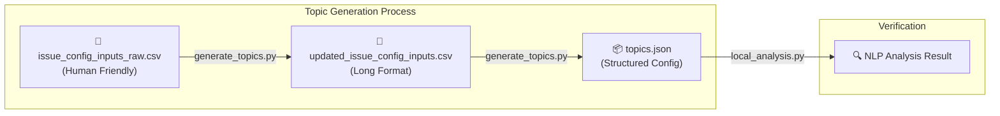

# Issue Definitions Configuration Framework

This repository provides a standalone framework for defining, generating, and applying "Issue Topics" using professional NLP tools. It is designed to exactly mirror the process used in the `earnings-call-transcript-analysis` production pipeline.

## 🏗️ How it Works

The system follows a professional "Source → Transform → Apply" workflow:



## 📂 Folder Contents

- **`issue_config_inputs_raw.csv`**: The primary source of truth. Define topics, patterns, exclusions, and anchors in a human-friendly format (semicolon separated).
- **`generate_topics.py`**: A two-step generator that:
    1. Transforms raw inputs into an intermediate long-format CSV.
    2. Converts the intermediate CSV into the final `topics.json` configuration.
- **`label_files.py`**: **NEW Interactive CLI Tool**. Point it at any CSV or XLSX file, pick a column, and it will apply the detection logic and save a labeled version to the `outputs` folder.
- **`analyzer.py`**: A modular class housing the core detection logic. Used by all analysis scripts.
- **`local_analysis.py`**: A demonstration script that verifies the `analyzer.py` logic against hardcoded sample texts.
- **`download_models.py`**: Utility to ensure all required NLP models are downloaded and ready for use.
- **`test_local_pipeline.py`**: A wrapper to verify the entire pipeline from generation to analysis.

## 🚀 Getting Started

The local tools are now **self-healing**. Simply running a command will automatically check for and install missing dependencies or AI models.

### 1. Label your local files (CLI)
You can process any data file immediately:
```bash
python label_files.py my_data.csv
```
*(On the first run, it will automatically download the 80MB+ AI model and install dependencies.)*

### 2. Run the Analysis Demo
Test the core logic against sample strings:
```bash
python local_analysis.py
```

### 3. Generate your Configuration (Manual)
If you update `issue_config_inputs_raw.csv`, regenerate the config:
```bash
python generate_topics.py
```

## 🛠️ Data Structure & Logic

| Feature | Type | Logic |
| :--- | :--- | :--- |
| **Patterns** | `pattern` | Processed into **spaCy** patterns for 100% accurate keyword matching. |
| **Anchors** | `anchor term` | Converted to **Vector Embeddings** for semantic similarity matching (Default: 0.7 threshold). |
| **Exclusions** | `exclusionary term` | **Negative Filter**: If found in text, the topic label is discarded to reduce noise. |
