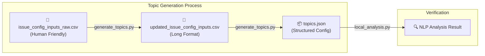

# Issue Definitions Configuration Framework

This repository provides a standalone framework for defining, generating, and applying "Issue Topics" using professional NLP tools. It is designed to exactly mirror the process used in the `earnings-call-transcript-analysis` production pipeline.

## 🏗️ How it Works

The system follows a professional "Source → Transform → Apply" workflow:



## 📂 Folder Contents

- **`issue_config_inputs_raw.csv`**: The primary source of truth. Define topics, patterns, exclusions, and anchors in a human-friendly format (semicolon separated).
- **`generate_topics.py`**: A two-step generator that:
    1. Transforms raw inputs into an intermediate long-format CSV.
    2. Converts the intermediate CSV into the final `topics.json` configuration.
- **`local_analysis.py`**: A high-fidelity demonstration script. It uses the exact same matching logic as the production pipeline:
    - **spaCy Matcher**: For precise keyword/pattern matching.
    - **SentenceTransformers**: For semantic similarity matching of anchor terms.
    - **Negative Filtering**: For applying exclusionary terms.
- **`download_models.py`**: Utility to ensure all required NLP models are downloaded and ready for use.
- **`test_local_pipeline.py`**: A wrapper to verify the entire pipeline from generation to analysis.

## 🚀 Getting Started

### 1. Installation
Install the dependencies:
```bash
pip install -r requirements.txt
```

### 2. Download Models
Ensure your environment has the necessary AI models:
```bash
python download_models.py
```

### 3. Generate your Configuration
Transform your raw definitions into machine-readable JSON:
```bash
python generate_topics.py
```

### 4. Run the Analysis Demo
Test your configuration using the local analysis script:
```bash
python local_analysis.py
```

## 🛠️ Data Structure & Logic

| Feature | Type | Logic |
| :--- | :--- | :--- |
| **Patterns** | `pattern` | Processed into **spaCy** patterns for 100% accurate keyword matching. |
| **Anchors** | `anchor term` | Converted to **Vector Embeddings** for semantic similarity matching (Default: 0.7 threshold). |
| **Exclusions** | `exclusionary term` | **Negative Filter**: If found in text, the topic label is discarded to reduce noise. |
